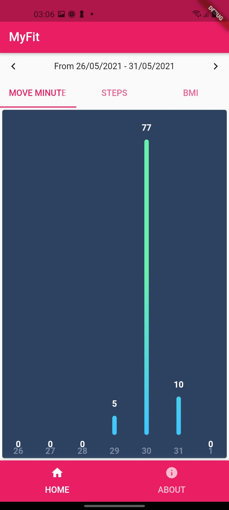
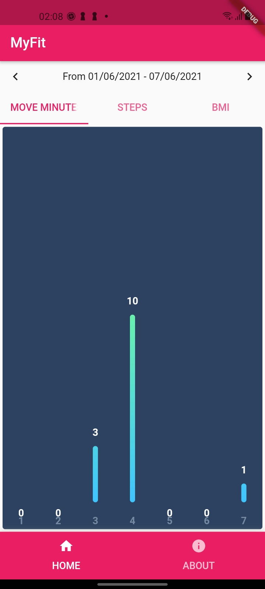

# My Fit
A Project for testing Google Fit, HealthKit on Flutter

## About
This project aims to do the following:
* Get permission to access health data
* Get health data from ranges
* Display health data on chart 

## TODO
I am using some very new and latest library so something are broken
* Mockito is not ideal for nullsafety project at this time
* health plugin not work with some health data on Android
* not tested on iOS
* not include CI/CD integration yet - (because it is a hackathon weekend project :D )

## Screenshots

## Development Environment
* Android Studio 4.2.1 
* MacOS 11.2.3
* Flutter 2.1
* Optimized for Android, Samsung QHD
